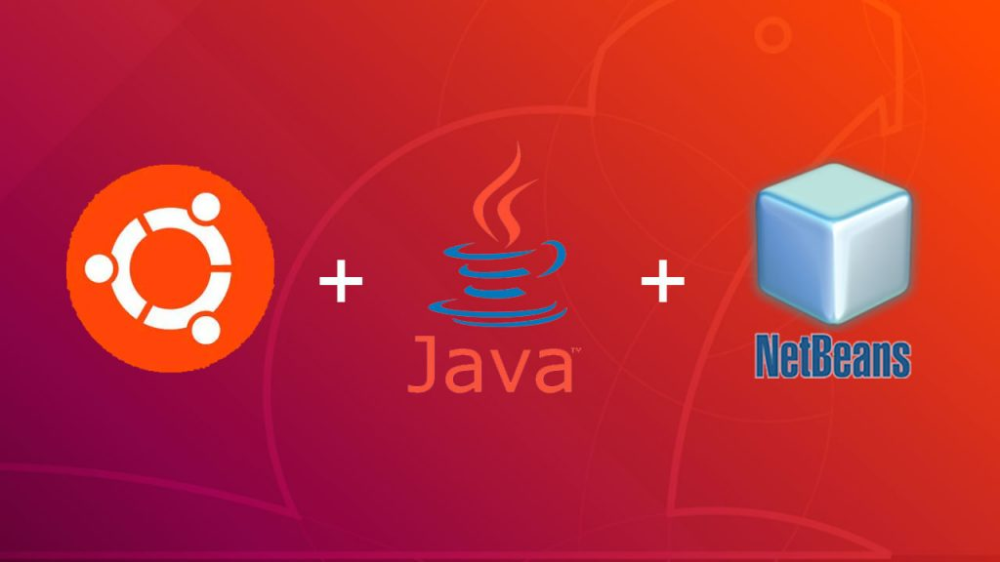
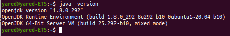
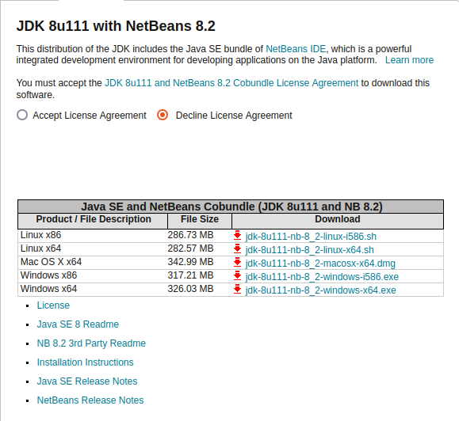
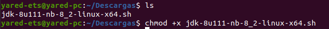
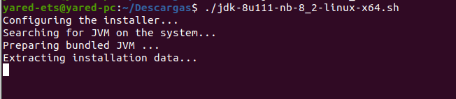
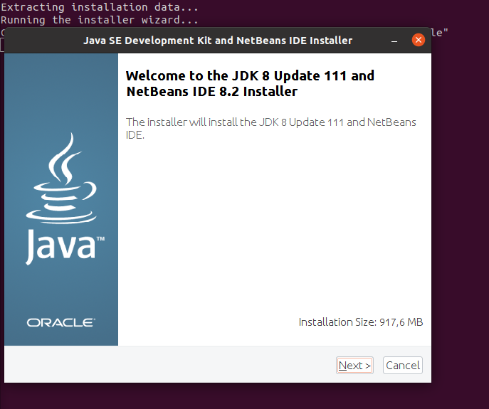
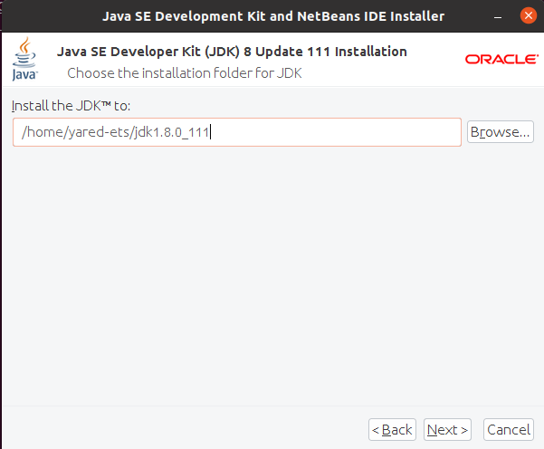
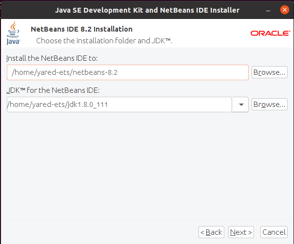
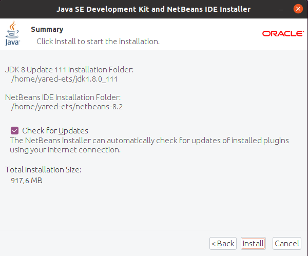
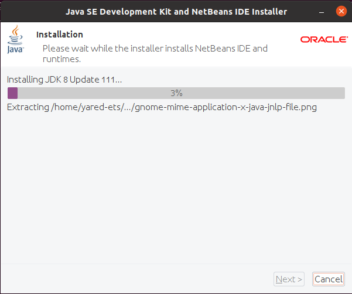

# Instalación del IDE Netbeans 8

Created: October 6, 2021 11:46 AM  

Created By: Yared Martín Pérez  

Github: https://github.com/Yared70/Yared-1DAM/tree/main/Entornos-de-Desarrollo/Practica3-InstalacionNetBeans8  

Tema: Tema 1: Instalación y uso de entornos de desarrollo  

Type: Informe

---

### ¿Qué es NetBeans?

NetBeans es un IDE popular para desarrollar aplicaciones Java. Esto permite desarrollar aplicaciones a partir de un conjunto de componentes de software modulares llamados módulos. 

---

## Índice

---

---

### Requisitos previos

Antes de instalar NetBeans debemos asegurarnos de tener java instalado con el siguiente comando:



---

# Pasos

---

Vamos a realizar la instalación de NetBeans a través de línea de comandos. Para ello vamos a seguir los siguientes pasos:

---

### Descarga de NetBeans 8

---

Descargar la versión deseada en este [enlace](https://www.oracle.com/technetwork/java/javase/downloads/jdk-netbeans-jsp-3413139-esa.html). Hemos de descargar la versión **jdk-8u111-nb-8_2-linux-x64.sh**, aceptando Accept License Agreement.




---

Una vez que se complete la descarga, navegue hasta el directorio donde se ha descargado el instalador de NetBeans IDE y ejecute el siguiente comando para hacer ejecutable el script del instalador y comenzar a instalarlo.

```
chmod +x jdk-8u111-nb-8_2-linux-x64.sh
./jdk-8u111-nb-8_2-linux-x64.sh
```



---



---

### Instalación NetBeans 8

Esperamos a que termine de ejecutar y se abrirá la pantalla de bienvenida:

---



- A partir de aquí, la instalación funcionará igual que cualquier otra instalación desde entorno gráfico. Saldrán ventanas de acuerdos de licencia que habrá que aceptar.
- Se podrá elegir donde queremos instalar NetBeans 8



---



---

- Tras la anterior ventana, habrá que activar las actualizaciones automáticas de los complementos instalados a través de la casilla de verificación y se mostrará también donde se instalará finalmente.
- Al darle a Install se realizará la instalación



---



- Cuando se completa la instalación, solo faltaría darle a Finish y reiniciar la máquina para poder usar NetBeans 8
