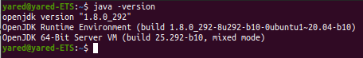
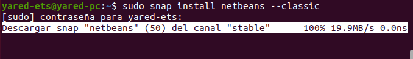
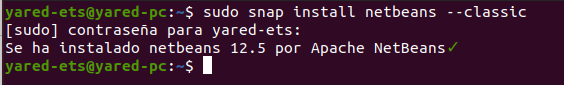
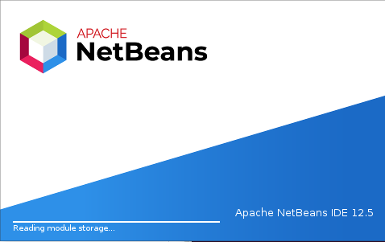
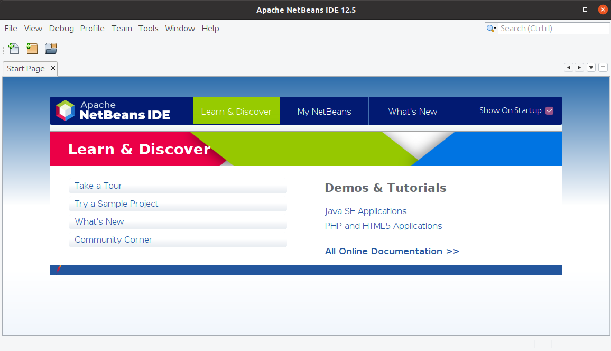

# Instalación del IDE Netbeans 12

Created: October 6, 2021 5:01 PM  
Created By: Yared Martín Pérez  
Github: https://github.com/Yared70/Yared-1DAM/tree/main/Entornos-de-Desarrollo/Practica4-InstalacionNetBeans12  
Tema: Tema 1: Instalación y uso de entornos de desarrollo  
Type: Informe  

---

### ¿Qué es NetBeans?

NetBeans es un IDE popular para desarrollar aplicaciones Java. Esto permite desarrollar aplicaciones a partir de un conjunto de componentes de software modulares llamados módulos. 

---


---

### Requisitos previos

Antes de instalar NetBeans debemos asegurarnos de tener java instalado con el siguiente comando:



---

# Pasos

---

Vamos a realizar la instalación de NetBeans a través de línea de comandos. Para ello vamos a seguir los siguientes pasos:

---

### Descarga de NetBeans 12

---

Para instalar la edición Netbeans 12, ejecutamos el siguiente comando:

```bash
sudo snap install netbeans --classic
```



---

Una vez que se complete la descarga, aparecerá el siguiente mensaje:



---

---

### Ejecutando NetBeans 12

Esperamos a que termine de instalar y lo iniciamos desde actividades o ejecutando netbeans en el terminal. Tras esto, nos saldrá la siguiente pantalla:

---



Y esta es la interfaz del programa ya abierto:



---

### Desinstalar Netbeans 12

En caso de que se quisiera desinstalar Netbeans 12 solo haría falta ejecutar el siguiente comando:


---
