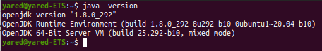
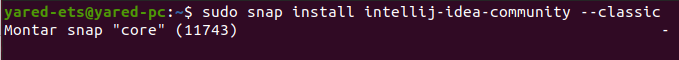
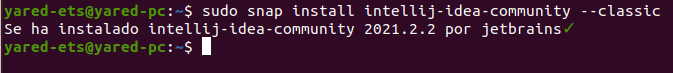
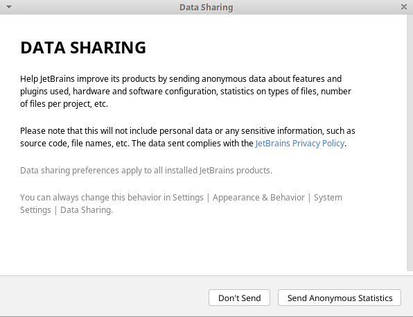

# Instalación del IDE IntelliJ IDEA

Created: October 6, 2021 6:41 PM  
Created By: Yared Martín Pérez  
Github: https://github.com/Yared70/Yared-1DAM/tree/main/Entornos-de-Desarrollo/Practica5-InstalacionIntellij  
Tema: Tema 1: Instalación y uso de entornos de desarrollo  
Type: Informe  

---

### ¿Qué es IntelliJ IDEA?

IntelliJ IDEA es un IDE (entorno de desarrollo integrado) de código  abierto para desarrollar aplicaciones Java. Es desarrollado y mantenido por Jetbrains, una compañía también popular para desarrollar PyCharm IDE.

---


---

### Requisitos previos

Antes de instalar IntelliJ debemos asegurarnos de tener java instalado con el siguiente comando:



---

# Pasos

---

Vamos a realizar la instalación de IntelliJ a través de línea de comandos usando Snap. Para ello vamos a seguir los siguientes pasos:

---

### Descarga e instalación de IntelliJ

---

Para instalar IntelliJ, ejecutamos el siguiente comando:

```bash
sudo snap install intellij-idea-community --classic
```




---

Una vez que se complete la descarga, aparecerá el siguiente mensaje:



---

### Lanzamiento de IntelliJ

Esperamos a que termine de instalar y lo iniciamos desde actividades o ejecutando intellij-idea-comunity en el terminal. Tras esto, nos saldrá la siguiente pantalla:


Aceptamos los términos de uso y nos saldrá la siguiente pantalla, donde podemos elegir si queremos enviar datos de uso o no:



Y nos saldrá la ventana de carga y finalmente se nos abrirá IntelliJ Idea:


