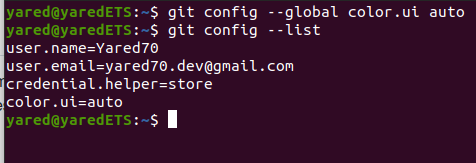
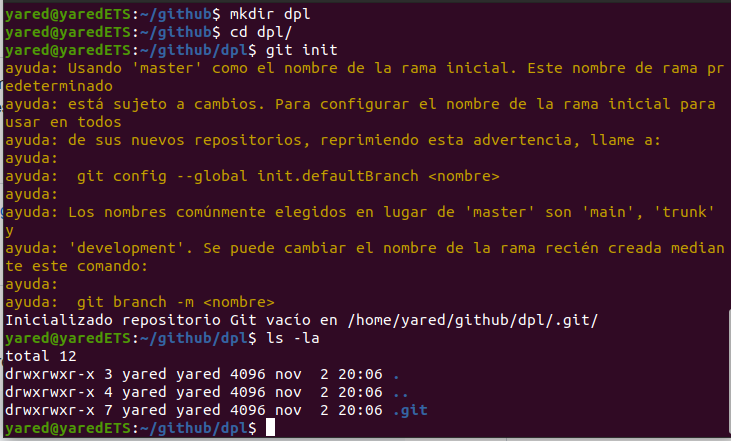
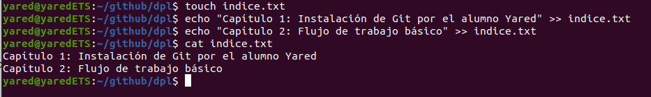
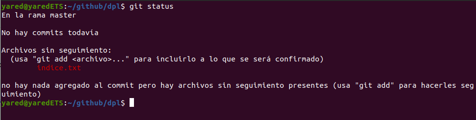
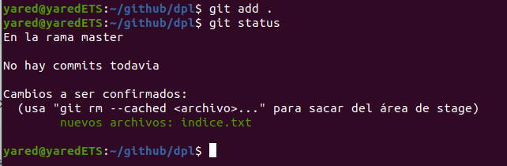
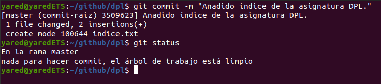
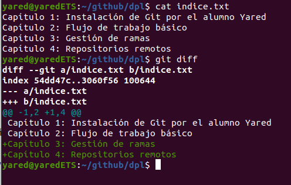
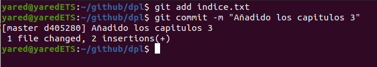
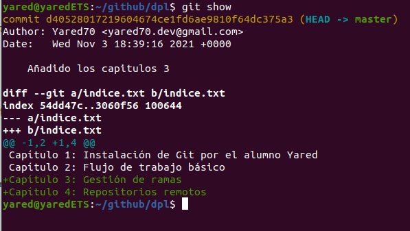
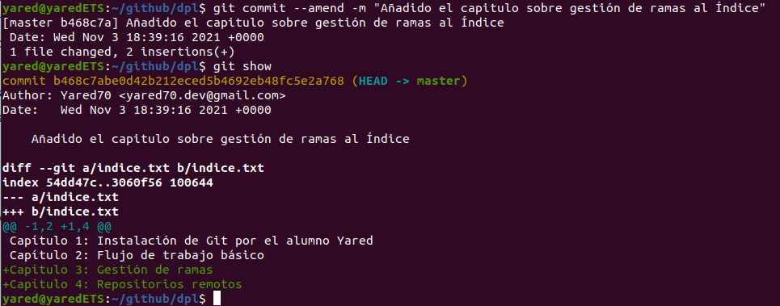

# Manipulación de repositorios en Git

Created: November 3, 2021 6:42 PM  
Created By: Yared Martín Pérez  
Github: https://github.com/Yared70/Yared-1DAM/tree/main/Entornos-de-Desarrollo/Practica9-ManipulacionGit/readme.md  
Tema: Tema 3: Documentación y Sistemas de control de versiones  
Type: Informe  


### ¿Qué es Git?

Git es un software de control de versiones diseñado por Linus
Torvalds, pensando en la eficiencia, la confiabilidad y compatibilidad
del mantenimiento de versiones de aplicaciones cuando estas tienen un
gran número de archivos de código fuente


### Requisitos previos


Tener una distribución de Linux con Git instalado y configurado

# Tareas

---

### Configuración


Empezamos configurando el usuario, el email, y el coloreado de salida de Git:

```bash
git config --global user.name "Your-Full-Name"
git config --global user.email "your-email-address"
git config --global color.ui auto
git config --list
```



### Creación de un repositorio


Creamos un repositorio llamado dpl y nos movemos a el:

```bash
mkdir dpl
cd dpl
git init
ls -la
```



### Comprobar el estado del repositorio


Empezamos creando un fichero indice.txt con el siguiente contenido:

```
Capítulo 1: Instalación de Git por el alumno XXX (donde XXX es el nombre del alumno)
Capítulo 2: Flujo de trabajo básico
```



Comprobamos el estado del repositorio:

```bash
git status
```



Añadimos el fichero a la zona de intercambio actual y comprobamos de nuevo el estado:

```bash
git add .
git status
```



### Realizando commit's


Realizamos un commit con el nombre **Añadido índice de la asignatura DPL** y volvemos a comprobar el estado del repositorio

```bash
git commit -m "Añadido índice de la asignatura DPL"
```



### Modificación de ficheros


Cambiamos el indice.txt y añadimos lo siguiente:

```
Capítulo 1: Instalación de Git por el alumno XXX (donde XXX es el nombre del alumno)
Capítulo 2: Flujo de trabajo básico
Capítulo 3: Gestión de ramas
Capítulo 4: Repositorios remotos
```

Y mostramos los cambios:

```bash
git diff
```



Hacemos un commit con el mensaje **Añadido los capitulos 3 y 4**

```bash
git add indice.txt
git commit -m "Añadido los capitulos 3"
```



### Historial


Mostramos los cambios de la última versión del repositorio con respecto a la anterior:

```bash
git show
```



Cambiamos el mensaje del último commit por **Añadido el capitulo sobre gestión de ramas al índice**  y comprobamos los cambios:

```bash
git commit --amend -m "Añadido el capitulo sobre gestión de ramas al índice."
```


