# Instalación de Maven en Ubuntu

Created: November 3, 2021 11:26 AM  
Created By: Yared Martín Pérez  
Github: https://github.com/Yared70/Yared-1DAM/tree/main/Entornos-de-Desarrollo/Practica2-InstalacionMaven  
Tema: Tema 1: Instalación y uso de entornos de desarrollo  
Type: Informe  

---

### ¿Qué es Maven?

Maven es una herramienta de software para la gestión y construcción de proyectos Java. Tiene un modelo de configuración de construcción más simple, basado en un formato XML

---


### Requisitos previos

Antes de instalar Maven debemos actualizar los repositorios con:

```bash
sudo apt-get update
```

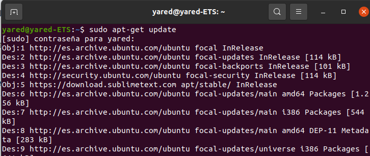


# Pasos
---

Vamos a realizar la instalación de Maven a través de línea de comandos. Para ello vamos a seguir los siguientes pasos:


## Descarga e instalación de Maven

---

Para instalar Maven, ejecutamos el siguiente comando:

```bash
sudo apt install maven
```

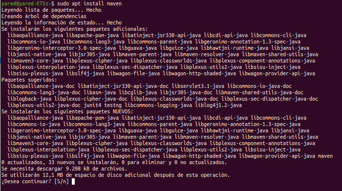

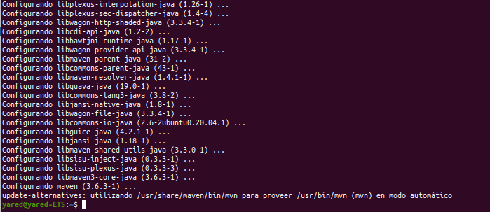

Y comprobamos la versión que se ha instalado con:

```bash
mvn -version
```

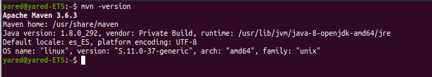

---

## **¿Cómo instalar una versión específica de Java?**

Para la instalación de una versión concreta de Maven se deberá ir a la página oficial para comprobar la versión

[https://maven.apache.org/download.cgi](https://maven.apache.org/download.cgi)

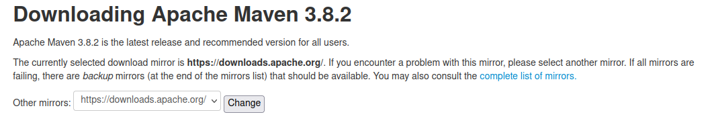

Una vez comprobado la versión mas actual, en este caso la 3.8.2, lo instalamos en la carpeta /tmp con el comando:

```bash
wget https://www.apache.org/dist/maven/maven-3/3.8.2/binaries/apache-maven-3.8.2-bin.tar.gz -P /tmp
```

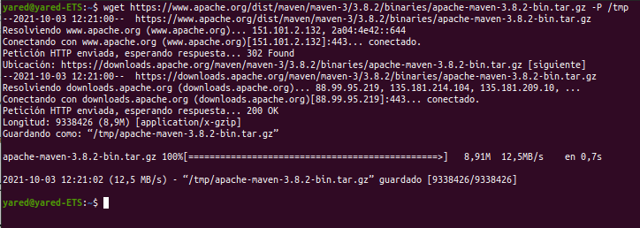

Y extraemos el archivo en la carpeta /otp con:

```bash
sudo tar xf /tmp/apache-maven-*.tar.gz -C /opt
```

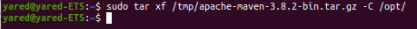

Para tener más control sobre las versiones y actualizaciones de Maven, creamos un enlace simbólico que apunte al directorio de instalación de Maven:

```bash
sudo ln -s /opt/apache-maven-3.8.2 /opt/maven
```

Cuando se lanza una nueva versión, podemos actualizar la instalación de Maven desempaquetando la última versión y cambiando el enlace simbólico para señalarla.

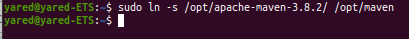

## Establecer las variables de entorno

---

Tras la instalación de Maven deberemos cambiar las variables de entorno para usar la nueva versión instalada de Maven.

Para hacer esto, abrimos un editor de texto, en este caso nano, y creamos un nuevo archivo llamado mavenenv.sh en el directorio /etc/profile.d/

```bash
sudo nano /etc/profile.d/maven.sh
```

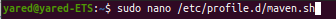

Y pegamos el siguiente código y guardamos el archivo:

```bash
export M2_HOME=/opt/maven
export MAVEN_HOME=/opt/maven
export PATH=${M2_HOME}/bin:${PATH}
```

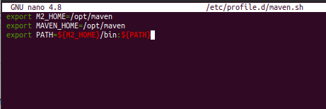

Hacemos el script ejecutable con:

```bash
sudo chmod +x /etc/profile.d/maven.sh
```

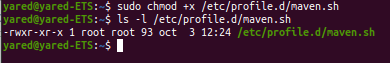

Y por último cargamos las variables de entorno con souce:

```bash
source /etc/profile.d/maven.sh
```

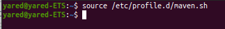

### Verificación de la instalación

---

Y para finalizar, comprobamos si se ha cambiado la versión con:

```bash
mvn -version
```

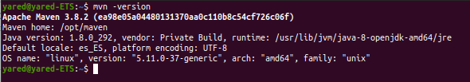
