# Manipulación avanzada de repositorios en Git

Created: November 7, 2021 11:29 PM  
Created By: Yared Martín Pérez  
Github: https://github.com/Yared70/Yared-1DAM/tree/main/Entornos-de-Desarrollo/Practica10-ManipulacionAvanzadaGit/readme.md  
Tema: Tema 3: Documentación y Sistemas de control de versiones  
Type: Informe  

---

### ¿Qué es Git?

Git es un software de control de versiones diseñado por Linus Torvalds, pensando en la eficiencia, la confiabilidad y compatibilidad del mantenimiento de versiones de aplicaciones cuando estas tienen un gran número de archivos de código fuente

---


## Requisitos previos


Para hacer estos ejercicios es necesario haber hecho antes los ejercicios sobre historial de cambios

# Tareas

---

### Ejercicio 1


- Mostrar el historial de cambios del repositorio.
- Crear la carpeta capítulos y crear dentro de ella el fichero capitulo1.txt con el siguiente texto.

```bash
Git es un sistema de control de versiones ideado por Linus Torvalds.
```

- Añadir los cambios a la zona de intercambio temporal.
- Hacer un commit de los cambios con el mensaje *Añadido capítulo 1.*
- Volver a mostrar el historial de cambios del repositorio.

```bash
> git log
> mkdir capitulos
> cat > capitulos/capitulo1.txt
Git es un sistema de control de versiones ideado por Linus Torvalds.
Ctrl+D
> git add .
> git commit -m "Añadido capítulo 1."
> git log
```

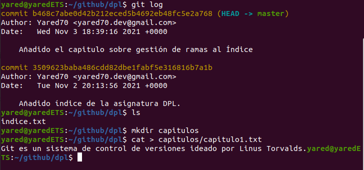

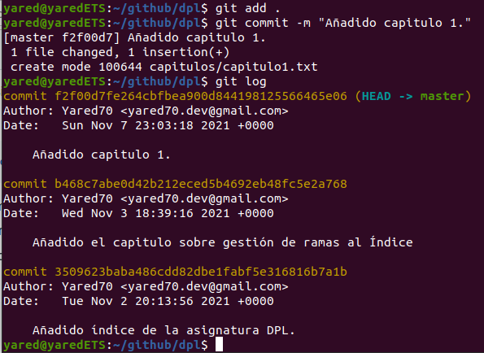

### Ejercicio 2

- Crear el fichero capitulo2.txt en la carpeta capítulos con el siguiente texto.

```bash
El flujo de trabajo básico con Git consiste en:
1- Hacer cambios en el repositorio.
2- Añadir los cambios a la zona de intercambio temporal.
3- Hacer un commit de los cambios.
```

- Añadir los cambios a la zona de intercambio temporal.
- Hacer un commit de los cambios con el mensaje *Añadido capítulo 2.*
- Mostrar las diferencias entre la última versión y dos versiones anteriores.

```bash
> cat > capitulos/capitulo2.txt
 El flujo de trabajo básico con Git consiste en:
 1- Hacer cambios en el repositorio.
 2- Añadir los cambios a la zona de intercambio temporal.
 3- Hacer un commit de los cambios.
 Ctrl+D
 > git add .
 > git commit -m "Añadido capítulo 2."
 > git diff HEAD~2..HEAD
```

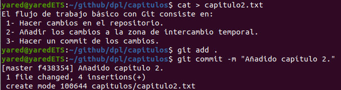

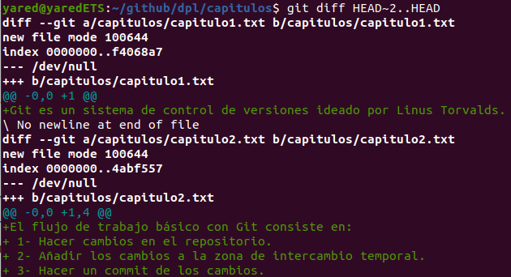

### Ejercicio 3

- Crear el fichero capitulo3.txt en la carpeta capítulos con el siguiente texto.

```bash
Git permite la creación de ramas lo que permite tener distintas versiones del mismo proyecto y trabajar de manera simultanea en ellas.
```

- Añadir los cambios a la zona de intercambio temporal.
- Hacer un commit de los cambios con el mensaje *Añadido capítulo 3.*
- Mostrar las diferencias entre la primera y la última versión del repositorio.

```bash
> cat > capitulos/capitulo3.txt
 Git permite la creación de ramas lo que permite tener distintas versiones del mismo proyecto y trabajar de manera simultanea en ellas.
 Ctrl+D
 > git add .
 > git commit -m "Añadido capítulo 3."
 > git log
 > git diff <codigo hash de la primera version>..HEAD
```

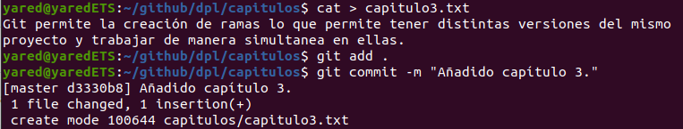

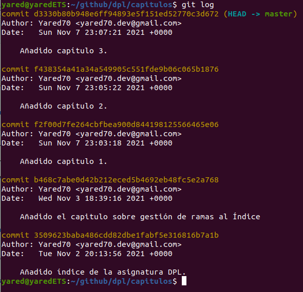

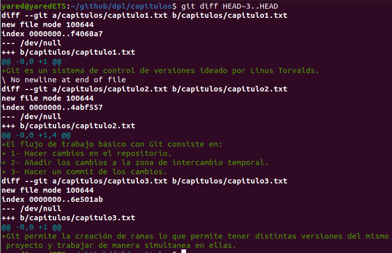

### Ejercicio 4

- Crea el fichero índice.txt la siguiente línea:

```bash
Indice de los cápitulos, con conceptos avanzados de git
```

- Añadir los cambios a la zona de intercambio temporal.
- Hacer un commit de los cambios con el mensaje *"Indice de los cápitulos, con conceptos avanzados de git*.
- Mostrar quién ha hecho cambios sobre el fichero *indice.txt*.

```bash
> cat > indice.txt
 > git add .
 > git commit -m "Se crea el indice."
 > echo "Indice de los cápitulos, con conceptos avanzados de git" >> indice.txt
 > git add .
 > git commit -m "Añadido el índice ."
 > git annotate indice.txt
```

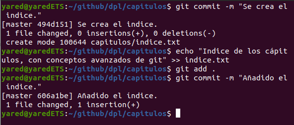

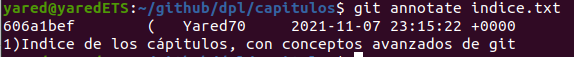

### Ejercicio 5

Crear una nueva rama bibliografía y mostrar las ramas del repositorio.

```bash
git branch bibliografia
> git branch -av
```

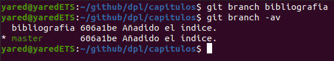

### Ejercicio 6

- Crear el fichero capitulos/capitulo4.txt y añadir el texto siguiente:

```bash
  En este capítulo veremos cómo usar GitHub para alojar repositorios en remoto.
```

- Añadir los cambios a la zona de intercambio temporal.
- Hacer un commit con el mensaje “Añadido capítulo 4.”
- Mostrar la historia del repositorio incluyendo todas las ramas.

```bash
> cat > capitulos/capitulo4.txt
En este capítulo veremos cómo usar GitHub para alojar repositorios en remoto.
Ctrl+D
> git add .
> git commit -m "Añadido capítulo 4."
> git log --graph --all --oneline
```

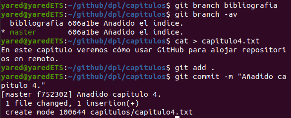

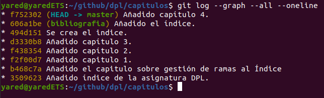

### Ejercicio 7

- Cambiar a la rama bibliografía.
- Crear el fichero bibliografia.txt y añadir la siguiente referencia:

```bash
Chacon, S. and Straub, B. Pro Git. Apress.
```

- Añadir los cambios a la zona de intercambio temporal.
- Hacer un commit con el mensaje “Añadida primera referencia bibliográfica.”
- Mostrar la historia del repositorio incluyendo todas las ramas.

```bash
> git checkout bibliografia
 > cat > bibliografia.txt
 - Chacon, S. and Straub, B. Pro Git. Apress.
 Ctrl+D
 > git add .
 > git commit -m "Añadida primera referencia bibliográfica."
 > git log --graph --all --oneline
```

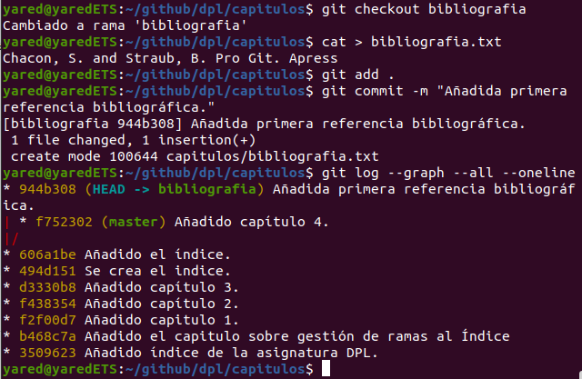

### Ejercicio 8

- Fusionar la rama bibliografía con la rama main.
- Mostrar la historia del repositorio incluyendo todas las ramas.
- Eliminar la rama bibliografía.
- Mostrar de nuevo la historia del repositorio incluyendo todas las ramas.

```bash
> git checkout main
> git merge bibliografia
> git log --graph --all --oneline
> git branch -d bibliografia
> git log --graph --all --oneline
```

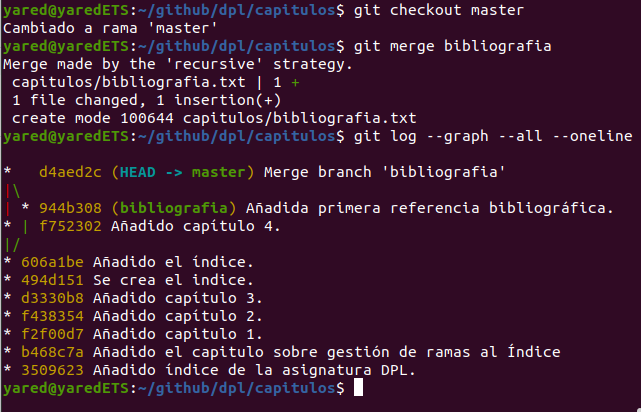

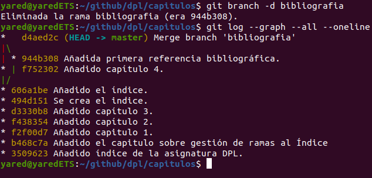

### Ejercicio 9

- Crear la rama bibliografía.
- Cambiar a la rama bibliografía.
- Cambiar el fichero bibliografia.txt para que contenga las siguientes referencias:

```bash
Scott Chacon and Ben Straub. Pro Git. Apress.
Ryan Hodson. Ry’s Git Tutorial. Smashwords (2014)
```

- Cambiar a la rama main.
- Cambiar el fichero bibliografia.txt para que - contenga las siguientes referencias:

```bash
Chacon, S. and Straub, B. Pro Git. Apress.
Loeliger, J. and McCullough, M. Version control with Git. O’Reilly.
```

- Añadir los cambios a la zona de intercambio temporal y hacer un commit con el mensaje “Añadida nueva referencia bibliográfica.”
- Fusionar la rama bibliografía con la rama main.
- Resolver el conflicto dejando el fichero bibliografia.txt con las referencias:

```bash
Chacon, S. and Straub, B. Pro Git. Apress.
Loeliger, J. and McCullough, M. Version control with Git. O’Reilly.
```

Hodson, R. Ry’s Git Tutorial. Smashwords (2014)

- Añadir los cambios a la zona de intercambio temporal y hacer un commit con el mensaje “Resuelto conflicto de bibliografía.”
- Mostrar la historia del repositorio incluyendo todas las ramas.

```bash
> git branch bibliografia
> git checkout bibliografia
> cat > bibliografia.txt
- Scott Chacon and Ben Straub. Pro Git. Apress.
- Ryan Hodson. Ry's Git Tutorial. Smashwords (2014)
Ctrl+D
> git commit -a -m "Añadida nueva referencia bibliográfica."
> git checkout main
> cat > bibliografia.txt
- Chacon, S. and Straub, B. Pro Git. Apress.
- Loeliger, J. and McCullough, M. Version control with Git. O'Reilly.
Ctrl+D
> git commit -a -m "Añadida nueva referencia bibliográfica."
> git merge bibliografia
> git nano bibliografia
# Hacer los cambios indicados en el fichero
> git commit -a -m "Solucionado conflicto bibliografía."
> git log --graph --all --oneline
```

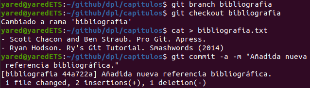

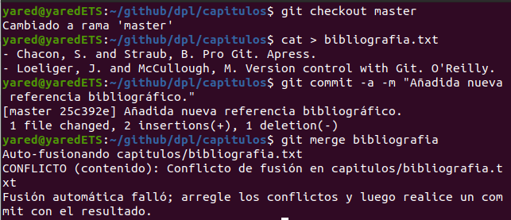

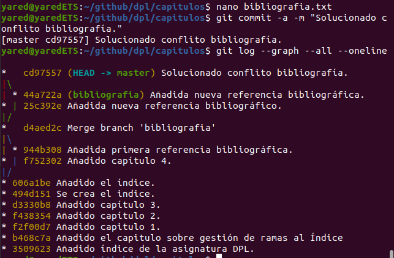
